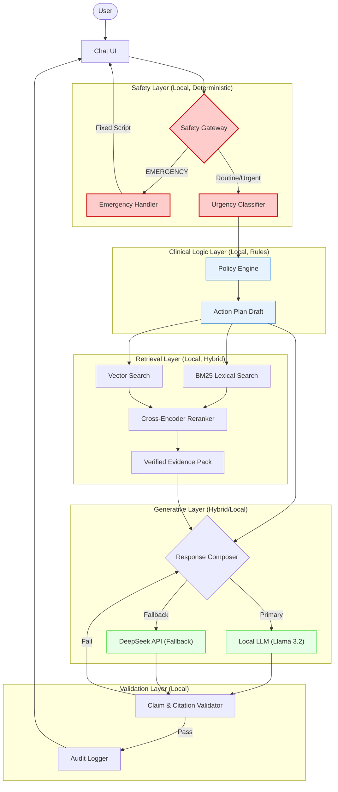

# Health Advisory Chatbot - Data Flow Architecture

> **Version:** 2.0 (Post-Rebuild)
> **Date:** Feb 10, 2026
> **Architecture:** Safety-Critical RAG with Local LLM

```mermaid
flowchart TD
    %% Nodes
    User(["User"])
    UI["Chat UI"]
    
    subgraph "Safety Layer (Local, Deterministic)"
        Gateway{Safety Gateway}
        Emergency["Emergency Handler"]
        Urgent["Urgency Classifier"]
    end
    
    subgraph "Clinical Logic Layer (Local, Rules)"
        Policy["Policy Engine"]
        ActionDraft["Action Plan Draft"]
    end
    
    subgraph "Retrieval Layer (Local, Hybrid)"
        BM25["BM25 Lexical Search"]
        Vector["Vector Search"]
        Reranker["Cross-Encoder Reranker"]
        Evidence["Verified Evidence Pack"]
    end
    
    subgraph "Generative Layer (Hybrid/Local)"
        Composer{Response Composer}
        LocalLLM["Local LLM (Llama 3.2)"]
        CloudLLM["DeepSeek API (Fallback)"]
    end
    
    subgraph "Validation Layer (Local)"
        Validator["Claim & Citation Validator"]
        Audit["Audit Logger"]
    end
    
    %% Flows
    User --> UI
    UI --> Gateway
    
    Gateway -->|EMERGENCY| Emergency
    Emergency -->|"Fixed Script"| UI
    
    Gateway -->|Routine/Urgent| Urgent
    Urgent --> Policy
    
    Policy --> ActionDraft
    
    ActionDraft --> BM25
    ActionDraft --> Vector
    
    BM25 --> Reranker
    Vector --> Reranker
    Reranker --> Evidence
    
    ActionDraft --> Composer
    Evidence --> Composer
    
    Composer -->|Primary| LocalLLM
    Composer -->|Fallback| CloudLLM
    
    LocalLLM --> Validator
    CloudLLM --> Validator
    
    Validator -->|Pass| Audit
    Validator -->|Fail| Composer
    
    Audit --> UI
    
    %% Styling
    classDef safety fill:#ffcccc,stroke:#cc0000,stroke-width:2px;
    classDef logic fill:#e6f3ff,stroke:#0066cc;
    classDef gen fill:#e6ffe6,stroke:#00cc00;
    
    class Gateway,Emergency,Urgent safety;
    class Policy,ActionDraft logic;
    class LocalLLM,CloudLLM gen;
```
