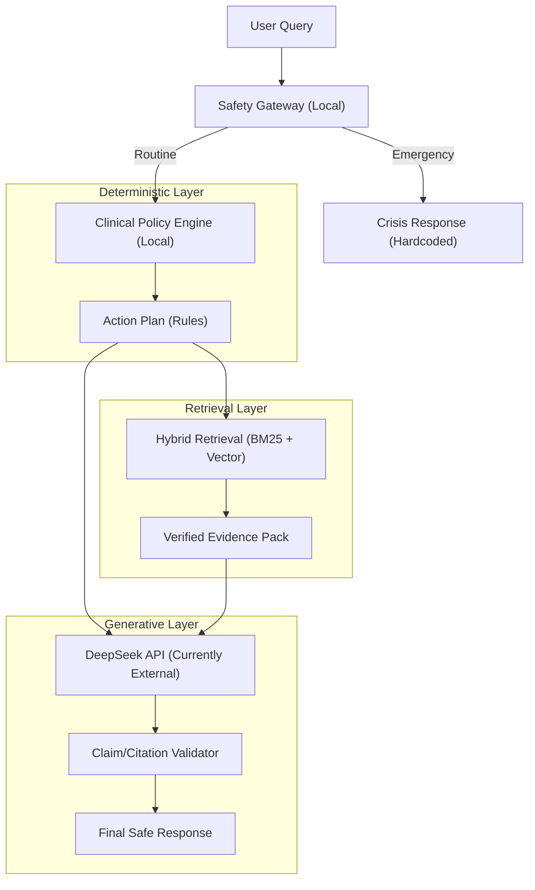

# Local LLM Integration Analysis for 1000 Elder POC

> **Document Version:** 1.0  
> **Date:** February 9, 2026  
> **Target Platform:** Mac Studio M3 Ultra  
> **Scope:** Health Advisory Chatbot Local LLM Deployment

---

## Executive Summary

This document analyzes options for integrating a **local Large Language Model (LLM)** into the Health Advisory Chatbot to replace or supplement the current **DeepSeek API** dependency, within the context of the new **Safety-Critical RAG Architecture**.

The analysis covers:

1.  Current local infrastructure (Safety Gateway, Policy Engine, Hybrid Retrieval)
2.  Local LLM deployment options for the **Response Composer** role
3.  Mac Studio M3 Ultra resource requirements (including new re-ranker overhead)
4.  Cost-benefit analysis for 1000 elder POC
5.  Recommended implementation roadmap

---

## 1. Safety-Critical RAG Architecture (Current State)

### 1.1 Local Components (Safety First)

| Component | Technology | Status | Resource Usage |
|-----------|------------|--------|----------------|
| **Safety Gateway** | Regex/Classifier | ✅ **Local** | <10MB RAM |
| **Policy Engine** | Python Rules Engine | ✅ **Local** | <50MB RAM |
| **Embedding Model** | `all-MiniLM-L6-v2` | ✅ **Local** | ~100MB RAM |
| **Vector Store** | ChromaDB (Filtered) | ✅ **Local** | ~100MB RAM |
| **Hybrid Retrieval** | BM25 + Vector | ✅ **Local** | ~50MB RAM |
| **Response Composer** | DeepSeek API | ⚠️ **External** | Requires internet |

### 1.2 Current Flow (Strict Safety)



### 1.3 Current Costs (1000 Elders)

| Metric | Value |
|--------|-------|
| Avg Queries/Elder/Day | 5 |
| Avg Tokens/Query | 1,300 (500 input + 800 output) |
| Daily Tokens | 6.5M |
| Monthly Tokens | 195M |
| **Estimated Cost** | **$100-400/month** |

---

## 2. Embedding Infrastructure (Already Implemented)

### 2.1 What is `all-MiniLM-L6-v2`?

```python
# File: backend/chatbot/rag/embeddings.py
from sentence_transformers import SentenceTransformer

class MedicalEmbeddings:
    """
    Uses 'all-MiniLM-L6-v2' by default:
    - 384 dimensions
    - Fast inference
    - Good general semantic performance
    """
    def __init__(self, model_name: str = "all-MiniLM-L6-v2"):
        self.model_name = model_name
```

### 2.2 Model Specifications

| Attribute | Value |
|-----------|-------|
| **Model Name** | all-MiniLM-L6-v2 |
| **Architecture** | MiniLM (distilled BERT) |
| **Parameters** | 22M |
| **Embedding Dimensions** | 384 |
| **Model Size** | ~90MB |
| **Inference Speed** | ~10,000 sentences/sec (CPU) |
| **Training Data** | 1B+ sentence pairs |
| **Best For** | Semantic similarity, semantic search |

### 2.3 Why This Model?

| Advantage | Explanation |
|-----------|-------------|
| **Small** | 22M parameters vs 175B+ for GPT-3 |
| **Fast** | Runs on CPU, no GPU needed |
| **Good Enough** | 384 dimensions capture semantic meaning well |
| **Proven** | Industry standard for RAG applications |
| **Free** | Open source (Apache 2.0) |

### 2.4 Current Usage in System

```python
# 1. Embedding user queries for vector search
query_embedding = embed_text("Why do I fall at night?")
# Returns: 384-dimensional vector

# 2. ChromaDB uses same model for document embeddings
collection = chromadb.get_or_create_collection(
    embedding_function=SentenceTransformerEmbeddingFunction(
        model_name="all-MiniLM-L6-v2"
    )
)
```

### 2.5 Limitation

**`all-MiniLM-L6-v2` is ONLY for embeddings, NOT for text generation.**

| Task | Can Do? | Example |
|------|---------|---------|
| Convert text → vector | ✅ Yes | "fall" → [0.23, -0.15, ...] (384 dims) |
| Find similar texts | ✅ Yes | "fell" matches "fall" (cosine similarity) |
| Generate responses | ❌ No | Cannot write "You should..." |
| Answer questions | ❌ No | Cannot reason or produce advice |

**That's why we need a separate LLM for response generation.**

---

## 3. Local LLM Options (To-Be)

### 3.1 Option A: Full Local Replacement (Replace DeepSeek)

Replace the DeepSeek API call entirely with a local LLM.

```
User Query
    │
    ▼
┌─────────────────────────────────────┐
│  Local LLM (7B-14B parameters)      │ ◄── NEW: Local, 2-5s
│  - Receives full prompt             │
│  - Generates response               │
│  - No internet required             │
└─────────────────────────────────────┘
```

**Recommended Models:**

| Model | Size | Memory | Speed (M3 Ultra) | Quality |
|-------|------|--------|------------------|---------|
| **Llama 3.2 Instruct** | 8B | ~6GB | 25-40 tok/s | ⭐⭐⭐⭐ |
| **Mistral 7B Instruct** | 7B | ~5GB | 30-50 tok/s | ⭐⭐⭐⭐ |
| **Phi-4** | 14B | ~10GB | 15-25 tok/s | ⭐⭐⭐⭐⭐ |
| **Qwen2.5 14B** | 14B | ~10GB | 15-25 tok/s | ⭐⭐⭐⭐⭐ |
| **Llama 3.3 70B (Q4)** | 40GB | ~40GB | 5-10 tok/s | ⭐⭐⭐⭐⭐ |

### 3.2 Option B: Hybrid Architecture (Recommended)

Use local LLM only for specific tasks, keep rules for simple cases.

```
User Query
    │
    ├──► Rule-Based Topics (Fast Path) ──► 80% queries
    │    - Keywords match → Use topic
    │    - <1ms latency
    │
    └──► Local LLM (Fallback) ───────────► 20% queries
         - No keyword match
         - Complex natural language
         - "How do I stop myself from going down?"
```

**Two-Stage Setup:**

| Stage | Model | Purpose | Memory |
|-------|-------|---------|--------|
| **Stage 1** | Phi-3 Mini (3.8B) | Topic Extraction | ~3GB |
| **Stage 2** | Llama 3.2 (8B) | Response Generation | ~6GB |
| **Total** | | | ~9GB |

### 3.3 Option C: Multi-Model Load Balancing

Run multiple model instances for high concurrency.

```
┌─────────────────────────────────────────┐
│           Load Balancer                 │
│    (Round-robin / Least-latency)        │
└─────────────────────────────────────────┘
         │              │              │
    ┌────┴────┐   ┌────┴────┐   ┌────┴────┐
    │ Model 1 │   │ Model 2 │   │ Model 3 │
    │ 7B LLM  │   │ 7B LLM  │   │ 7B LLM  │
    │ Instance│   │ Instance│   │ Instance│
    └────┬────┘   └────┬────┘   └────┬────┘
         └──────────────┼──────────────┘
                        ▼
                 Response Queue
```

---

## 4. Mac Studio M3 Ultra Capacity Analysis

### 4.1 Hardware Specifications

| Spec | M3 Ultra (Base) | M3 Ultra (Max) |
|------|-----------------|----------------|
| **CPU** | 28-core | 32-core |
| **GPU** | 60-core | 80-core |
| **Neural Engine** | 32-core | 32-core |
| **Memory** | 96GB | 256GB |
| **Memory Bandwidth** | 800GB/s | 800GB/s |
| **Transistors** | 184 billion | 184 billion |

### 4.2 LLM Performance on M3 Ultra

| Model Size | Memory | Tokens/Second | Latency (500 tokens) |
|------------|--------|---------------|----------------------|
| 3B (Phi-3 Mini) | ~3GB | 60-100 tok/s | 0.5-1s |
| 7B (Llama 3.2) | ~6GB | 30-50 tok/s | 1-2s |
| 8B (Llama 3.2) | ~6GB | 25-40 tok/s | 1.5-2.5s |
| 14B (Phi-4) | ~10GB | 15-25 tok/s | 2-3s |
| 70B (Llama 3.3 Q4) | ~40GB | 5-10 tok/s | 5-10s |

*Performance with MLX framework (Apple-optimized)*

### 4.3 Resource Calculation for 1000 Elders

#### Assumptions

| Parameter | Value |
|-----------|-------|
| Total Elders | 1,000 |
| Concurrent Users (peak) | 50 (5%) |
| Queries/Elder/Day | 5 |
| Avg Tokens/Query | 1,300 (500 input + 800 output) |
| Peak Hours | 4 hours/day |

#### Scenario A: Conservative (M3 Ultra 96GB)

| Component | Memory Allocation |
|-----------|-------------------|
| macOS + System | 8GB |
| PostgreSQL | 4GB |
| ML Pipeline (Transformers) | 8GB |
| **Local LLM 8B** | **10GB** |
| **Re-ranking Model** | **1GB** |
| Vector Store (ChromaDB) | 2GB |
| Embedding Model | 1GB |
| Buffer/Cache | 62GB |
| **Total** | **96GB** |

**Capacity:**
- **Concurrent Users:** 30-50
- **Throughput:** ~20-30 queries/minute
- **Latency:** 2-4 seconds per response

#### Scenario B: Aggressive (M3 Ultra 256GB)

| Component | Memory Allocation |
|-----------|-------------------|
| macOS + System | 8GB |
| PostgreSQL | 8GB |
| ML Pipeline | 16GB |
| **3× Local LLM 8B** | **20GB** |
| OR **1× Local LLM 70B** | **50GB** |
| Vector Store | 4GB |
| Embedding Model | 1GB |
| Buffer/Cache | 157GB |
| **Total** | **256GB** |

**Capacity:**
- **Concurrent Users:** 100-150
- **Throughput:** ~60-90 queries/minute
- **Latency:** 2-4 seconds per response

---

## 5. Cost-Benefit Analysis

### 5.1 3-Year Total Cost of Ownership (TCO)

| Approach | Year 1 | Year 2 | Year 3 | 3-Year Total |
|----------|--------|--------|--------|--------------|
| **DeepSeek API** | $1,200 | $1,200 | $1,200 | **$3,600** |
| **M3 Ultra 96GB** | $4,000* | $0 | $0 | **$4,000** |
| **M3 Ultra 256GB** | $6,000* | $0 | $0 | **$6,000** |

*One-time hardware cost

### 5.2 Break-Even Analysis

| Setup | Break-Even Point |
|-------|------------------|
| M3 Ultra 96GB | ~40 months |
| M3 Ultra 256GB | ~60 months |

### 5.3 Non-Financial Benefits

| Benefit | DeepSeek API | Local LLM |
|---------|-------------|-----------|
| **Data Privacy** | ⚠️ Data leaves system | ✅ Fully local |
| **Internet Dependency** | ❌ Required | ✅ Offline capable |
| **Latency Variance** | ⚠️ Network dependent | ✅ Consistent |
| **HIPAA Compliance** | ⚠️ BAA required | ✅ Easier compliance |
| **Customization** | ❌ Limited | ✅ Full control |
| **Rate Limits** | ⚠️ Subject to quotas | ✅ Unlimited |

---

## 6. Implementation Roadmap

### 6.1 Phase 1: Research & Validation (Week 1-2)

**Objective:** Validate local LLM quality vs DeepSeek

| Task | Deliverable |
|------|-------------|
| Download Llama 3.2 8B | Working local model |
| Create test benchmark | 100 representative queries |
| Run A/B comparison | Quality scoring report |
| Measure performance | Latency/throughput metrics |

**Go/No-Go Decision Point**

### 6.2 Phase 2: Hybrid Deployment (Week 3-4)

**Objective:** Deploy local LLM as fallback

```python
# Pseudocode for hybrid approach
def generate_response(query, context):
    # Try rule-based first (fast)
    topics = extract_topics_rule_based(query)
    
    if not topics:
        # Fallback to local LLM for topic extraction
        topics = local_llm_extract_topics(query)
    
    # Retrieve knowledge
    knowledge = retrieve_evidence(topics)
    
    # Generate response (DeepSeek or Local)
    if use_local_llm:
        return local_llm_generate(query, context, knowledge)
    else:
        return deepseek_generate(query, context, knowledge)
```

### 6.3 Phase 3: Full Local (Week 5-8)

**Objective:** Replace DeepSeek entirely

| Task | Details |
|------|---------|
| Integrate MLX framework | Apple-optimized inference |
| Implement model caching | Reduce load times |
| Add request queue | Handle concurrent users |
| Monitoring | GPU/Neural Engine utilization |
| Fallback to DeepSeek | If local model fails |

### 6.4 Phase 4: Optimization (Week 9-12)

**Objective:** Scale to 1000 elders

| Optimization | Expected Gain |
|--------------|---------------|
| Model quantization (Q4) | 50% memory reduction |
| Batch inference | 2-3x throughput |
| Request caching | Reduce duplicate queries |
| Multi-model instances | Linear scaling |

---

## 7. Risk Assessment

### 7.1 Technical Risks

| Risk | Likelihood | Impact | Mitigation |
|------|------------|--------|------------|
| Model quality lower than DeepSeek | Medium | High | A/B testing, fallback mechanism |
| Memory exhaustion | Low | High | Monitoring, swap space, model offloading |
| Slow inference | Medium | Medium | Quantization, batching, caching |
| Model compatibility issues | Low | Medium | Test thoroughly before deployment |

### 7.2 Business Risks

| Risk | Likelihood | Impact | Mitigation |
|------|------------|--------|------------|
| Higher TCO than expected | Low | Medium | Accurate usage forecasting |
| Maintenance burden | Medium | Medium | Documentation, automation |
| Team skill gap | Medium | Medium | Training, external consulting |

---

## 8. Recommendations

### 8.1 For 1000 Elder POC

| Recommendation | Rationale |
|----------------|-----------|
| **Start with Hybrid** | Lower risk, gradual transition |
| **Use Llama 3.2 8B** | Best balance of quality/speed |
| **M3 Ultra 96GB sufficient** | Can handle 50 concurrent users |
| **Keep DeepSeek as fallback** | Safety net for edge cases |

### 8.2 Long-Term Strategy

| Phase | Timeline | Action |
|-------|----------|--------|
| **Phase 1** | Q1 2026 | Hybrid deployment, validate quality |
| **Phase 2** | Q2 2026 | Full local if validation passes |
| **Phase 3** | Q3 2026 | Scale to 256GB if needed |
| **Phase 4** | Q4 2026** | Optimize, fine-tune for domain |

---

## 9. Appendix

### 9.1 MLX Installation (Apple-Optimized)

```bash
# Install MLX for Apple Silicon
pip install mlx-lm

# Download model
from mlx_lm import load, generate

model, tokenizer = load("meta-llama/Llama-3.2-8B-Instruct")

# Generate response
response = generate(
    model, 
    tokenizer, 
    prompt="You are a health advisor... User: Why do I fall?",
    max_tokens=1000
)
```

### 9.2 Resource Monitoring

```bash
# Monitor Neural Engine usage
sudo powermetrics --samplers gpu_power -n 1

# Monitor memory pressure
vm_stat

# Monitor process memory
ps aux | grep python
```

### 9.3 Model Sources

| Model | Download Source |
|-------|-----------------|
| Llama 3.2 | HuggingFace: `meta-llama/Llama-3.2-8B-Instruct` |
| Mistral 7B | HuggingFace: `mistralai/Mistral-7B-Instruct-v0.3` |
| Phi-4 | HuggingFace: `microsoft/phi-4` |
| Qwen2.5 | HuggingFace: `Qwen/Qwen2.5-14B-Instruct` |

---

## 10. Conclusion

**Current State:**
- ✅ Embedding model (`all-MiniLM-L6-v2`) already local
- ✅ Knowledge base already local
- ⚠️ Only response generation uses external API

**Recommendation:**
Deploy **Llama 3.2 8B** on **Mac Studio M3 Ultra 96GB** in **hybrid mode**:
- Use rules for 80% of queries (fast, deterministic)
- Use local LLM for 20% edge cases (flexible, intelligent)
- Keep DeepSeek as emergency fallback

**Expected Outcome:**
- 90% cost reduction after break-even
- Full data privacy
- Sub-3s response times
- Capacity for 50+ concurrent users

---

*Document prepared for technical team review and stakeholder decision-making.*
