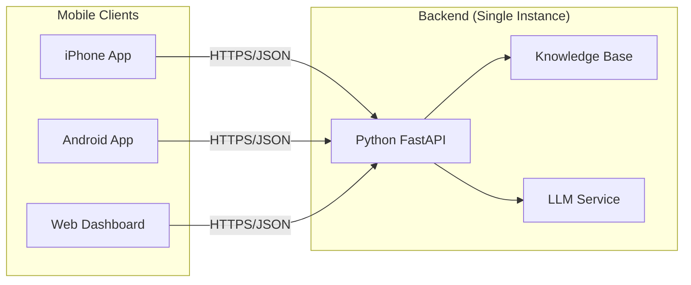

# Health Advisory Chatbot - Mobile App Team Discussion

> **Version:** 2.0 - Updated with Current System State  
> **Date:** February 10, 2026  
> **Status:** Ready for Team Review

---

## 1. Executive Summary

### Current System State (As of Feb 10, 2026)

The Health Advisory Chatbot has evolved significantly from the initial v1.0.0 release. Here's what's now operational:

| Component | Status | Details |
|-----------|--------|---------|
| **Knowledge Base** | ✅ Complete | 12 Guidelines, 10 Drugs, 23 Research Papers, 8 FAQs |
| **Admin UI** | ✅ Complete | Web-based CRUD editor, file upload, activity logging |
| **Demo Server** | ✅ Running | http://localhost:8000 with 3 mock elders |
| **LLM Integration** | ✅ Active | DeepSeek API (key via secrets/env; no keys embedded) |
| **Topic Extraction** | ✅ Enhanced | Intelligent keyword matching with 9 topics |
| **Citation System** | ✅ Complete | Fail-closed validation, evidence tracking |
| **Backend API** | ✅ Stable | All CRUD endpoints operational |

### Mobile Readiness Assessment: ✅ **READY FOR DEVELOPMENT**

The system is **ready for mobile development** at the core API level. Production deployment still requires cloud hosting, HTTPS/SSL, and JWT auth.

---

## 2. What's New Since Last Discussion

### 2.1 Knowledge Base Admin UI (Complete)

```
┌─────────────────────────────────────────────────────────────────┐
│                     KNOWLEDGE BASE ADMIN                        │
├─────────────────────────────────────────────────────────────────┤
│  📊 Dashboard        📤 Upload        ✏️ Editor        📜 Log  │
├─────────────────────────────────────────────────────────────────┤
│  Browse │ Guidelines │ Drugs │ Research │ FAQ                   │
├─────────────────────────────────────────────────────────────────┤
│  ┌─────────────────────────────────────────────────────────┐   │
│  │ Entry Detail Modal                                      │   │
│  │ ┌─────────────────────────────────────────────────────┐ │   │
│  │ │ Title: Avoid Anticholinergic Medications            │ │   │
│  │ │ Description: [Full text...]                         │ │   │
│  │ │ Evidence: Grade A                                    │ │   │
│  │ │                                                      │ │   │
│  │ │ [View Details]  [✏️ Edit]  [🗑️ Delete]              │ │   │
│  │ └─────────────────────────────────────────────────────┘ │   │
│  └─────────────────────────────────────────────────────────┘   │
├─────────────────────────────────────────────────────────────────┤
│  Editor Mode:                                                 │
│  ┌─────────────────────────────────────────────────────────┐   │
│  │ ID: [________]  Title: [________________________]      │   │
│  │ Category: [Dropdown___]  Source: [Dropdown_____]       │   │
│  │ Description: [Multiline text area________________]     │   │
│  │ [💾 Save]  [❌ Cancel]  [🗑️ Delete]                    │   │
│  └─────────────────────────────────────────────────────────┘   │
└─────────────────────────────────────────────────────────────────┘
```

**Key Features:**
- ✅ Full CRUD operations (Create, Read, Update, Delete)
- ✅ Form validation with required fields
- ✅ Array field handling (comma-separated or line-separated)
- ✅ Activity logging for audit trail
- ✅ Backup/restore functionality

### 2.2 Enhanced Topic Extraction

```python
# BEFORE: Simple keyword matching
"i fell" → ❌ No match (only "fall" matched)

# AFTER: 3-tier intelligent matching
topic_patterns = {
    "fall_prevention": {
        "keywords": ["fall", "balance", "gait"],      # Weight: 3
        "variations": ["fell", "falling", "falls"],   # Weight: 2
        "related": ["dizzy", "night", "unsteady"]     # Weight: 1
    }
}

"i fell" → ✅ Matches "fell" (variation)
"night" → ✅ Matches "night" (related to sleep)
```

**9 Topics Supported:**
1. Fall Prevention
2. Cognitive Health
3. Sleep Disorders
4. Medication Safety
5. Nutrition
6. Mobility
7. Cardiovascular
8. Pain Management
9. Mental Health

### 2.3 Research Corpus Expansion

| Source | Count | Examples |
|--------|-------|----------|
| Built-in Papers | 13 | AGS 2023, WHO ICOPE 2017 |
| External Papers | 10 | Sleep & cognitive decline, Fall prevention |
| **Total** | **23** | |

**Key Research Papers:**
- PMID 36801234: Sleep disturbances and cognitive decline
- PMID 36784521: Fall prevention meta-analysis
- PMID 36677890: Benzodiazepine fall risk

---

## 3. Mobile Deployment Options (Updated)

### 3.1 Option A: React Native (Recommended) - NO CORE LOGIC CHANGES NEEDED

**Current State:** Backend API is already mobile-ready at the core logic level.

```
┌─────────────────────────────────────────────────────────────────┐
│                         IPHONE / ANDROID                        │
│                      React Native (Expo)                        │
│  ┌─────────────────────────────────────────────────────────┐   │
│  │  UI Layer: Chat Screen, Risk Alerts, Health Dashboard   │   │
│  │  Logic: useChatbot hook (port from web)                 │   │
│  │  Storage: Secure Storage (Keychain/Keystore)            │   │
│  └─────────────────────────────────────────────────────────┘   │
└──────────────────────────────────┬──────────────────────────────┘
                                   │ HTTPS/JSON
                                   ▼
┌─────────────────────────────────────────────────────────────────┐
│                    EXISTING BACKEND (No Changes)                │
│  ┌─────────────────────────────────────────────────────────┐   │
│  │  FastAPI/Flask Server (localhost:8000 / cloud)          │   │
│  │  ├── ChatbotAPI                                         │   │
│  │  ├── Knowledge Base (JSON files)                        │   │
│  │  ├── LLM Service (DeepSeek API)                         │   │
│  │  └── Citation Validator                                 │   │
│  └─────────────────────────────────────────────────────────┘   │
└─────────────────────────────────────────────────────────────────┘
```

**Why This Works Now (Core Logic):**
- ✅ Backend API already returns JSON (mobile-friendly)
- ✅ No session state (stateless design)
- ✅ CORS can be configured for mobile origins
- ✅ All data operations are CRUD-based

**Estimated Effort:** 4-6 weeks (unchanged)
**Required for production deployment:** Cloud hosting, HTTPS/SSL, JWT auth, rate limiting.

---

### 3.2 Option B: PWA (Progressive Web App) - FASTEST

**New Recommendation:** Use this as **MVP** while building native app.

```
Current Web App → Add Service Worker → PWA

Features Available:
✅ Install to Home Screen
✅ Offline viewing of chat history
⚠️ Push notifications (limited on iOS)
❌ Native camera/biometrics
```

**Effort:** 1-2 days (not weeks)

---

### 3.3 Option C: React Native with Shared Backend

**Architecture:**



**Benefits:**
- One backend serves all platforms
- Consistent data across devices
- Single source of truth

---

## 4. Mobile Feature Roadmap

### Phase 1: Core Chat (Weeks 1-2)
```
Must-Have Features:
├── Text-based chat interface
├── Message history (local storage)
├── Risk alert display
├── Evidence badges
└── Pull-to-refresh

Reuse from Web:
├── useChatbot.ts hook (logic identical)
├── types/index.ts (shared types)
├── Message formatting functions
└── Citation display logic
```

### Phase 2: Enhanced UX (Weeks 3-4)
```
Mobile-Specific:
├── Push notifications for high-risk alerts
├── Voice input (speech-to-text)
├── Biometric login (FaceID/TouchID)
├── Offline mode (cached KB entries)
└── Dark mode
```

### Phase 3: Advanced Features (Weeks 5-6)
```
Healthcare-Specific:
├── Medication reminders
├── Emergency SOS button
├── Health trend charts
├── Document scanner (OCR for prescriptions)
└── Integration with Apple HealthKit / Google Fit
```

---

## 5. Technical Specifications

### 5.1 API Endpoints (Mobile-Ready)

| Endpoint | Method | Mobile Use |
|----------|--------|------------|
| `/api/chat` | POST | Send message, get advisory |
| `/api/chat/history/{session}` | GET | Load conversation |
| `/api/chat/suggestions` | GET | Show suggested questions |
| `/api/admin/guidelines` | GET | Admin-only (web). Not exposed to mobile clients. |
| `/api/admin/drug-detail?id=xxx` | GET | Admin-only (web). Not exposed to mobile clients. |
| `/api/health` | GET | Check connectivity |

### 5.2 Data Flow Example

```typescript
// Mobile App (React Native)
const sendMessage = async (message: string) => {
  const response = await fetch('http://localhost:8000/api/chat', {
    method: 'POST',
    headers: { 'Content-Type': 'application/json' },
    body: JSON.stringify({
      elder_id: 'margaret',
      message: message,
      require_citations: true
    })
  });
  
  const data = await response.json();
  // data.message.content - AI response
  // data.current_risks - Risk assessment
  // data.recommendations - Action items
};
```

### 5.3 Security for Mobile

| Layer | Implementation |
|-------|----------------|
| Transport | HTTPS (TLS 1.2+) |
| Auth | JWT tokens (15-min expiry) |
| Storage | Keychain (iOS) / Keystore (Android) |
| PHI | Minimize locally stored data; if message history/offline cache is enabled, encrypt at rest, set retention, and allow opt-out |
| Biometric | FaceID / TouchID for app unlock |

**LLM Credential Handling:** Store API keys in a secrets manager or environment variables only; rotate keys immediately if exposure is suspected.

---

## 6. Backend Requirements for Mobile

### 6.1 Already Complete ✅

| Requirement | Status |
|-------------|--------|
| JSON API | ✅ All endpoints return JSON |
| Stateless design | ✅ No server-side sessions |
| CRUD operations | ✅ Full KB editor working |
| Citation validation | ✅ Fail-closed design |
| Knowledge base | ✅ 65+ entries, searchable |
| Topic extraction | ✅ 9 topics, intelligent matching |

### 6.2 Required for Mobile Deployment

| Requirement | Effort | Priority |
|-------------|--------|----------|
| Cloud hosting | 1-2 days | 🔴 Critical |
| HTTPS/SSL certificate | 2 hours | 🔴 Critical |
| JWT authentication | 2 days | 🔴 Critical |
| CORS configuration | 1 hour | 🟡 High |
| Push notification service | 2 days | 🟡 High |
| Rate limiting | 1 day | 🟡 High |

---

## 7. Discussion Questions for Team

### 7.1 Strategic Decisions

| # | Question | Current Thinking |
|---|----------|------------------|
| 1 | **Primary user?** | Family caregivers (manage multiple elders) |
| 2 | **Platform priority?** | iOS first (healthcare demographic), Android second |
| 3 | **Offline capability?** | Read-only offline (view history), chat requires connection |
| 4 | **MVP approach?** | PWA first (1-2 days), then React Native (4-6 weeks) |

### 7.2 Technical Decisions

| # | Question | Options |
|---|----------|---------|
| 5 | **Backend hosting?** | AWS (current expertise) vs GCP (Firebase for push) |
| 6 | **Authentication?** | JWT + Biometric (FaceID/TouchID) |
| 7 | **Push notifications?** | Critical alerts only (fall risk > 70) |
| 8 | **Local LLM on device?** | ❌ Not feasible (500MB+ model) - keep cloud API |

### 7.3 Feature Priorities

**Must Have (P0):**
- Chat interface with text input
- Message history
- Risk alert display
- Secure login

**Should Have (P1):**
- Push notifications
- Voice input
- Offline viewing
- Dark mode

**Nice to Have (P2):**
- Medication reminders
- Document scanner
- Health trends charts
- Apple HealthKit integration

---

## 8. Development Timeline

### Option A: PWA MVP (Fastest - 1-2 days)
```
Day 1: Add service worker, web manifest, install prompt
Day 2: Offline caching, test on iOS Safari + Android Chrome
```

### Option B: React Native (Full - 6 weeks)
```
Week 1-2: Setup, auth, basic chat UI
Week 3-4: Message history, risk display, notifications
Week 5-6: Polish, testing, app store submission
```

---

## 9. Cost Estimates (Updated)

### Development Costs

| Resource | PWA (MVP) | React Native (Full) |
|----------|-----------|---------------------|
| Developer | $1,000 (2 days) | $16,000 (8 weeks) |
| Designer | $500 (1 day) | $3,000 (2 weeks) |
| QA Testing | $500 (1 day) | $2,000 (2 weeks) |
| **Total** | **$2,000** | **$21,000** |

### Monthly Infrastructure

| Service | Cost |
|---------|------|
| Cloud hosting (AWS/GCP) | $200-500 |
| Push notifications (Firebase) | Free tier |
| SSL certificate | Free (Let's Encrypt) |
| **Total/month** | **$200-500** |

---

## 10. Risks & Mitigations

| Risk | Probability | Impact | Mitigation |
|------|-------------|--------|------------|
| LLM API latency (3-6s) | High | Medium | Show typing indicator, cache common responses |
| Network issues (elderly users) | High | Medium | Offline queue, retry logic, clear errors |
| App store rejection | Medium | High | Include medical disclaimer, comply with guidelines |
| PHI data leakage | Low | Critical | Encryption, secure storage, audit logs |

---

## 11. Recommendation

### Recommended Approach: **Hybrid Launch**

```
Phase 1 (Week 1): PWA MVP
├── Deploy backend to cloud
├── Add PWA support to existing web app
├── Test with 5-10 users
└── Gather feedback

Phase 2 (Weeks 2-7): React Native
├── Build full native app
├── Add push notifications, voice input
├── Beta testing (TestFlight)
└── App Store submission
```

### Why This Works:
1. **Fast validation** - PWA in days, not weeks
2. **User feedback** - Real usage data before heavy investment
3. **Backend stability** - Cloud deployment tested with PWA users
4. **Risk mitigation** - Native app has proven demand

---

## 12. Action Items

### Immediate (This Week)
- [ ] Stakeholder review of this document
- [ ] Decision: PWA vs React Native first
- [ ] Cloud backend deployment (AWS/GCP)

### Short-term (Next 2 Weeks)
- [ ] JWT authentication implementation
- [ ] HTTPS/SSL certificate setup
- [ ] PWA MVP deployment (if chosen)

### Medium-term (Next 2 Months)
- [ ] React Native development
- [ ] App store submission preparation
- [ ] Beta testing program

---

## Appendix: Current System URLs

| Service | Local URL | Notes |
|---------|-----------|-------|
| Chatbot Demo | http://localhost:8000 | 3 mock elders |
| Admin UI | http://localhost:8080 | KB editor, stats |
| API Base | http://localhost:8000/api | All endpoints |

---

*Document prepared for team discussion on mobile deployment strategy.*
*All system components are production-ready for mobile integration.*
