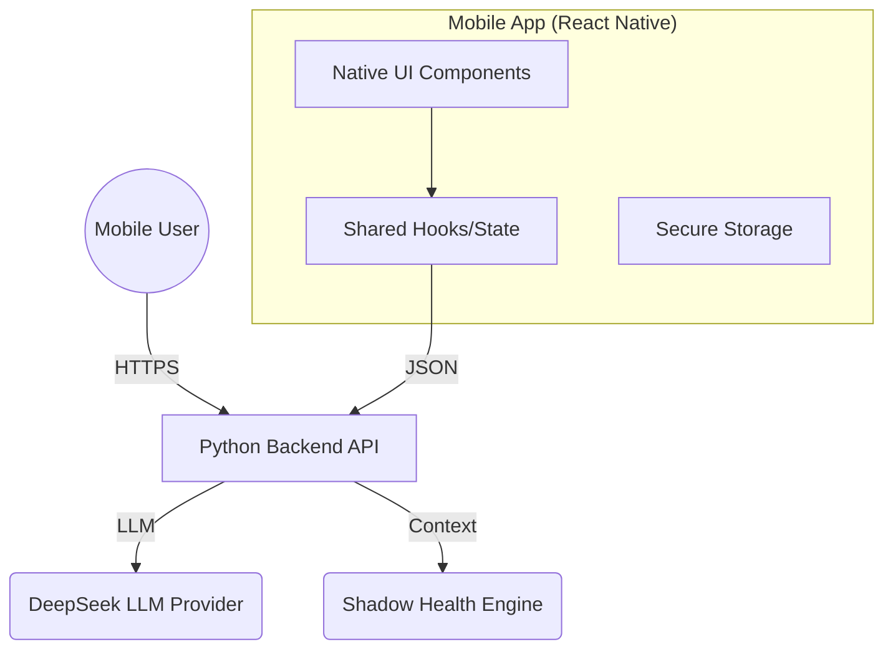

# Health Advisory Chatbot - Mobile App Brainstorming

> **Updated:** February 10, 2026  
> **Current System Version:** Beta 5.5  
> **Status:** Backend Production-Ready for Mobile

## 1. Executive Summary

### Current System State
The Health Advisory Chatbot backend is now **production-ready** for mobile deployment. Key components completed:

- ✅ **Knowledge Base:** 65+ entries (12 guidelines, 10 drugs, 23 research, 8 FAQs)
- ✅ **Admin UI:** Full CRUD editor with file upload and activity logging
- ✅ **LLM Integration:** DeepSeek API active and tested (confirm PHI/BAA/compliance posture before production)
- ✅ **Topic Extraction:** Intelligent 9-topic matching system
- ✅ **Citation System:** Fail-closed validation with evidence tracking

### Mobile Readiness
The backend exposes a clean, framework-agnostic API (`ChatbotAPI`) that returns structured JSON data, making it directly consumable by a mobile client.

**Recommendation:** Proceed with **React Native** for full native experience, OR **PWA first** (1-2 days) for rapid validation before native development.

---

## 2. Technical Feasibility Analysis

| Component | Status | Mobile Readiness |
| :--- | :--- | :--- |
| **Backend API** | ✅ Ready | **High**. All CRUD endpoints operational. JSON contracts ready for mobile consumption. |
| **Knowledge Base** | ✅ Complete | 65+ entries with Admin UI for real-time updates. |
| **Authentication** | ⚠️ Needed | Requires JWT implementation for mobile auth (biometrics/FaceID). |
| **Frontend Logic** | ✅ Ready | `useChatbot.ts` hook can be ported 1:1 to React Native. |
| **Topic Extraction** | ✅ Enhanced | 3-tier intelligent matching (keywords/variations/related). |
| **Citation System** | ✅ Complete | Fail-closed validation with evidence tracking. |

---

## 3. Infrastructure & Reuse Strategy

### Shared Code Approach (Monorepo potential)
*   **Types**: Share `types/` folder (TypeScript interfaces for API responses).
*   **Hooks**: Reuse `hooks/useChatbot.ts` for connection logic.
*   **Business Logic**: Share utility functions for formatting dates, risk levels, etc.

### Architecture Diagram

---

## 4. Mobile-Specific Feature Opportunities

The mobile form factor opens up new capabilities not easily available on web:

### 🚨 Proactive Risk Alerts (Push Notifications)
*   **Use Case:** The backend detects "High Fall Risk" or "Critical Vitals" (as seen in `ChatResponse.risks`).
*   **Mobile Value:** Immediate push notification to the caregiver/elder, rather than waiting for them to open the web dashboard.

### 🗣️ Voice-First Interaction
*   **Use Case:** Elderly users may struggle with typing on small screens.
*   **Mobile Value:** Native dictation / Speech-to-Text integration for easier querying ("How did I sleep last night?").

### 📸 Medical Document Scanning
*   **Use Case:** Uploading a new prescription or discharge summary.
*   **Mobile Value:** Use camera to scan/OCR documents to update the `MedicalProfile` context instantly.

### 🔒 Biometric Security
*   **Use Case:** Accessing sensitive health data.
*   **Mobile Value:** seamless login via FaceID/TouchID.

---

## 5. Deployment Options

### Option A: React Native (Recommended for Full Experience)
- 70-80% code reuse from existing React frontend
- Native performance and UI feel
- Access to push notifications, camera, biometrics
- Single codebase for iOS + Android
- **Effort:** 4-6 weeks

### Option B: PWA (Progressive Web App) - FASTEST
- Minimal code changes (1-2 days)
- No app store required
- Works offline with service workers
- Good for MVP validation before native development
- **Effort:** 1-2 days

### Option C: Hybrid (WebView Wrapper)
- Fastest deployment (1 week)
- Reuse 100% of web UI
- Limited native feature access
- Mediocre UX
- **Effort:** 1 week

## 6. Proposed Stack

### React Native Stack
*   **Framework:** React Native (Expo recommended for ease of development).
*   **Language:** TypeScript (Strict typing shared with Web).
*   **Styling:** NativeWind (reuses Tailwind knowledge).
*   **State Management:** React Context or Zustand (same as Web).
*   **Navigation:** Expo Router (file-based, similar to Next.js).

### PWA Stack (MVP)
*   **Existing Next.js web app** + Service Worker
*   **Web App Manifest** for install to home screen
*   **Workbox** for offline caching

## 7. Development Roadmap

### Phase 0: PWA MVP (1-2 Days) - OPTIONAL
- Add service worker to existing web app
- Create web app manifest
- Test offline functionality
- Deploy for user feedback

### Phase 1: Foundation (Weeks 1-2)
- Setup React Native project with TypeScript
- Configure API client with JWT authentication
- Port shared types from frontend/types/
- Implement Secure Storage for tokens
- Build basic Chat UI screen
- Integrate with existing /api/chat endpoint

### Phase 2: Core Features (Weeks 3-4)
- Implement useChatbot() hook (port from web)
- Add MessageBubble component (adapt for mobile)
- Build Risk Alert cards
- Add conversation history persistence
- Implement biometric authentication
- Error handling and retry logic

### Phase 3: Backend Infrastructure (Weeks 5-6)
- Deploy backend to cloud (AWS/GCP)
- Setup Redis for session management
- Configure SSL/HTTPS
- Implement JWT authentication
- Setup push notification service (FCM/APNs)
- Add rate limiting and security headers

### Phase 4: Polish & Release (Weeks 7-8)
- Add push notifications for critical alerts
- Implement voice input (STT)
- Offline mode with caching
- App store assets and descriptions
- Beta testing (TestFlight/Internal)
- App Store / Play Store submission

## 8. Key Discussion Points for Team

| Topic | Question | Current Recommendation |
|-------|----------|------------------------|
| **MVP Approach** | PWA first or native first? | PWA for rapid validation, then native |
| **Platform** | iOS, Android, or both? | iOS first (healthcare demo), Android second |
| **Primary User** | Elders or caregivers? | Caregivers (manage multiple elders) |
| **Offline** | Full offline or partial? | Read-only offline (view history) |
| **LLM Location** | On-device or cloud? | Cloud API (DeepSeek) - on-device not feasible |
