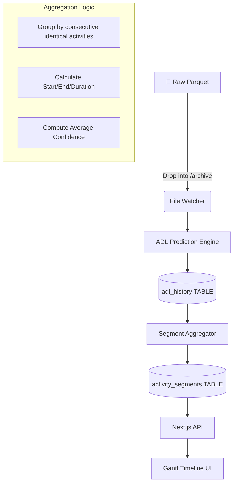

# 🏗️ Beta 3.5 Data Architecture: Scaling for Reality

In Beta 3.5, we introduced sophisticated data aggregation to solve the "Memory Crash" issue that occurs when processing high-fidelity sensor data.

---

## 1. The Data Hierarchy

We now maintain a two-tier storage system to balance **precision** and **performance**.

### Tier 1: Raw Events (`adl_history`)
- **Granularity**: 10 seconds.
- **Volume**: ~34,000 records per day for a single resident.
- **Usage**: Used for deep-dive analysis, training simulations, and data export.
- **Storage**: SQLite table `adl_history`.

### Tier 2: Activity Segments (`activity_segments`) 🆕
- **Granularity**: Logical blocks (e.g., "Sleep for 5 hours").
- **Volume**: ~50–200 records per day.
- **Usage**: Used for rendering the **Web UI Activity Timeline**.
- **Performance**: Provides a **99.5% reduction** in data transferred to the browser.
- **Storage**: SQLite table `activity_segments`.

---

## 2. Updated Data Flow (ETL)

### The Move to Parquet (Beta 5) 🚀
Excel files (`.xlsx`) became a bottleneck at scale. We now archive and train using **Apache Parquet**:
- **90% Smaller Files**: Significant disk savings.
- **Columnar Storage**: Optimized for ML feature extraction.
- **Unified Loader**: `data_loader.py` handles the seamless transition.

---

## 3. Database Schema Details

All data resides in `data/processed/residents_master_data.db`.

### `activity_segments` Table
| Column | Type | Description |
| :--- | :--- | :--- |
| `elder_id` | TEXT | Foreign Key (Resident ID) |
| `room` | TEXT | Location (e.g., kitchen, bedroom) |
| `activity_type` | TEXT | Labeled Activity |
| `start_time` | DATETIME | Beginning of segment |
| `end_time` | DATETIME | End of segment |
| `duration_minutes` | FLOAT | Total time in minutes |
| `event_count` | INTEGER | Number of 10s events consolidated |

| `event_count` | INTEGER | Number of 10s events consolidated |

| `key` | TEXT | Config Key (e.g., `activity_labels`, `room_thresholds`) |
| `value` | TEXT | JSON-encoded configuration value |
| `updated_at` | DATETIME | Last modification timestamp |

### `icope_assessments` Table (New in Beta 5)
Stores the logic results of the clinical ICOPE framework.
| Column | Type | Description |
| :--- | :--- | :--- |
| `elder_id` | TEXT | Resident ID |
| `assessment_date` | TEXT | Date of evaluation (YYYY-MM-DD) |
| `overall_score` | INTEGER | Weighted vitality baseline [0-100] |
| `trend` | TEXT | 'improving', 'stable', 'declining' |
| `recommendations` | TEXT | JSON list of clinical suggestions |

---

## 4. Scaling Insights

### The "99.5% Story"
By moving the aggregation of segments to the backend (Python), we solved the browser memory exhaustion. 
- **Before**: Browser tried to render 34,635 circles on a single chart → **CRASH**.
- **After**: Browser renders ~150 horizontal bars → **Instant Load (< 1s)**.

---
*Next: Read the [Data Labeling Guide](labeling_guide.md) to learn how to feed this architecture.*
