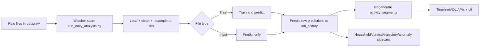

# Beta 5.5 Data Flow Logic

## 1. Scope
This document summarizes the operational data flow from raw sensor files to final ADL timeline output.

For code-level details, use:
- `ml_adl_e2e_technical_flow.md`

## 2. High-Level Pipeline

## 3. Core Runtime Sequence
1. File arrives in `data/raw`.
2. `backend/run_daily_analysis.py` detects and routes file.
3. `backend/process_data.py` loads sheets via `backend/utils/data_loader.py`.
4. Data is normalized to canonical 10-second timeline.
5. `backend/ml/pipeline.py` performs train+predict (train files) or predict-only (input files).
6. Per-row outputs are stored in `adl_history`.
7. Segmentation logic regenerates `activity_segments` for timeline consumption.
8. Downstream services compute household/context/sleep/ICOPE/anomaly outputs.

## 4. Label Authority Chain
1. Manual correction / golden sample (`is_corrected=1`)
2. Training file label (`activity` in train sheets)
3. Model prediction

The system protects corrected rows from accidental overwrite.

## 5. Event-First Evaluation Path
Evaluation for model promotion is separate from runtime inference.

1. Validate incoming pack (`validate_label_pack.py`).
2. Diff baseline vs candidate (`diff_label_pack.py`).
3. Run smoke (`run_event_first_smoke.py`).
4. Run matrix profile (`run_event_first_matrix.py`).
5. Apply go/no-go policy (`backend/config/event_first_go_no_go.yaml`).

## 6. Output Tables Most Used by Team
- `adl_history`: atomic predictions and corrected labels
- `activity_segments`: timeline blocks shown to users
- `household_segments`, `context_episodes`, `trajectory_events`: downstream context outputs

## 7. Operational Truth
- Runtime pipeline creates the resident timeline.
- Event-first matrix pipeline controls release/promotion decisions.
- Keep these paths separate in analysis and incident triage.
