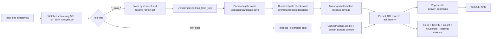

# Beta 6 Data Flow Logic

## 1. Scope
This document summarizes the active Beta 6 runtime data flow from raw files to timeline outputs.

For code-level detail, use:
- `ml_adl_e2e_technical_flow.md`

## 2. High-Level Pipeline

## 3. Runtime Sequence (actual)
1. Watcher `backend/run_daily_analysis.py` scans `data/raw` every 30 seconds.
2. It ignores transient/system files (`~$*`, dotfiles) and `_manual_` files.
3. Training files are grouped by resident and executed once per resident batch via `train_files(...)`.
4. Inference files are processed one-by-one via `process_file(...)`.

## 4. Training Path
1. Retrain input set is resolved by `RETRAIN_INPUT_MODE`:
   - `auto_aggregate` (default): incoming + archived history (deduplicated by training identity).
   - `incoming_only`: current incoming batch only.
   - `manifest_only`: explicit list from `RETRAIN_MANIFEST_PATH`.
2. `UnifiedPipeline.train_from_files(...)` performs room-level training with:
   - leakage-free preprocessing/scaling,
   - pre-training gate stack (`CoverageContract`, `PostGapRetention`, `ClassCoverage`),
   - post-training checks (`StatisticalValidity`, release/lane-B checks),
   - versioned artifact save via model registry.
3. Run-level promotion control in watcher then applies:
   - decision-trace artifact gate,
   - optional walk-forward promotion gate,
   - backbone alignment gate,
   - Beta6 authority gate,
   - global gate with rollback/deactivation safeguards.
4. Timeline rows for training runs are materialized from labels using `_build_legacy_training_timeline_results(...)`, then persisted and segmented.

## 5. Inference Path
1. `process_file(...)` calls `UnifiedPipeline.predict(...)`.
2. Prediction pipeline includes:
   - calibrated class thresholds to emit `low_confidence`,
   - optional inference hysteresis,
   - Beta6 HMM runtime hook,
   - Beta6 unknown-abstain runtime hook,
   - scoped runtime unknown conversion caps.
3. Golden samples are then overlaid before persistence.

## 6. Label Authority Chain
1. Manual correction / golden sample (`is_corrected=1`) is highest authority.
2. Training labels (`activity` in train sheets) are next.
3. Model prediction is last.

Corrected rows are protected from overwrite in persistence logic.

## 7. Primary Output Tables
- `adl_history`: atomic row-level timeline source with correction/model metadata.
- `activity_segments`: contiguous timeline blocks consumed by UI.
- `household_segments`, `context_episodes`, `trajectory_events`, `routine_anomalies`: downstream analytics outputs.

## 8. Operational Truth
- Watcher runtime builds product timeline outputs.
- Event-first scripts are evaluation/release tooling and remain a separate path.
