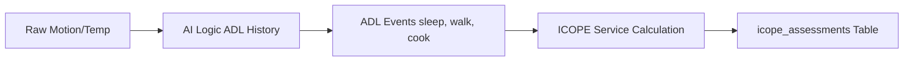

# 🏥 Integrated Care for Older People (ICOPE) Framework

The **WHO ICOPE** (Integrated Care for Older People) framework is a clinical approach used to detect functional decline in older individuals. In our system, we use a digital version of this framework, derived from daily sensor data activities (ADL), to calculate a "Vitality Baseline."

---

## 🏗️ 1. Data Source & Ingestion

The ICOPE Assessment is **secondary data**. It does not come from the sensors directly, but from the **AI's interpretation** of those sensors.

- **Frequency**: Calculated daily at the end of the `process_data.py` pipeline.
- **Granularity**: 7-day rolling window for score stability, compared against historical baselines.
- **Phase 1 Limitation**: Current logic assumes a **Singleton Household** (one person). Multi-resident calibration is planned for Phase 2.

---

## 📊 2. Domain Calculation Formulas

The overall score is a weighted average (default: 0-100) across 5 core domains.

### A. Locomotion (Mobility)
*Measures the elder's ability to move within their physical environment.*
- **Formula**: `60 + (Unique_Rooms * 5) + (Transitions / 5)`
- **Variables**:
  - `Unique_Rooms`: Number of different rooms visited today (max: 5).
  - `Transitions`: Number of times the person moved from one room to another.
- **Goal**: Detect early signs of furniture-walking or room-confinement.

### B. Vitality (Energy Level)
*Measures consistent engagement in non-sedentary activities.*
- **Formula**: `50 + (Active_Events / 10)`
- **Variables**:
  - `Active_Events`: Count of 10-second intervals labeled as non-sedentary (Excludes: Sleep, Nap, Inactive, Sitting).
- **Goal**: Track physical stamina and active engagement.

### C. Cognition (Routine Consistency)
*Uses prediction predictability as a proxy for cognitive regularity.*
- **Formula**: `100 - (Low_Confidence_Rate * 100)`
- **Variables**:
  - `Low_Confidence_Rate`: Proportion of the day where the AI's "Confidence" score was low. 
- **Rationale**: A high rate of "Unknown" or erratic behavior often signals a break in a established cognitive routine.

### D. Psychological (Social Engagement)
*Measures time spent in "shared" versus "private" spaces, including community engagement.*
- **Formula**: `60 + (Social_Engagement_Ratio * 50)`
- **Variables**:
  - `Social_Engagement_Ratio`: Percentage of active time spent in Social Rooms (Living, Dining, Kitchen) **OR** with the activity label `out`.
- **Goal**: Identify signs of social withdrawal or depressive isolation vs. active community participation.

### E. Sensory (Environmental Awareness)
*A proxy score based on behavioral response to environment.*
- **Baseline**: 90
- **Environmental Modifier**:
  - If Light Sensor Variance is high (active window adjustment) → Score = 95
  - If Light Sensor Variance is extremely low (darkness/constant shade) → Score = 75
- **Goal**: Identify if environmental stimulation is reaching the resident.

---

## 📈 3. Trend Analysis & Stability

Unlike raw activity counts, ICOPE focuses on the **trajectory**.

| Trend Label | Calculation Logic |
| :--- | :--- |
| **Improving** | Today's Score ≥ (Last Week's Average + 5) |
| **Stable** | Today's Score is within +/- 5 points of Last Week |
| **Declining** | Today's Score ≤ (Last Week's Average - 5) |

> [!IMPORTANT]
> A score of **100 is not "perfect" health**—it is a baseline for that specific individual. Sudden deviations in the **Trend** are often more clinically significant than the absolute score.

---

## 🛠️ 4. Technical Table (Reference)

| Column | Type | Description |
| :--- | :--- | :--- |
| `overall_score` | REAL | Weighted average of all 5 domains. |
| `trend` | TEXT | 'improving', 'stable', 'declining'. |
| `recommendations` | JSON | Actionable steps (e.g. "Encourage social area use"). |

---
*Back to the [Team Portal](readme.md)*
